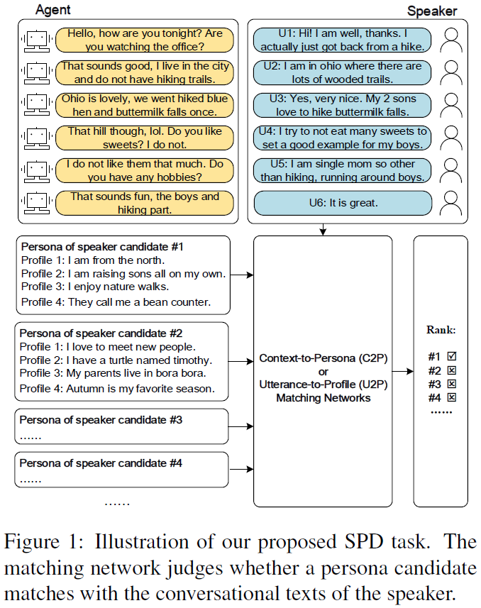
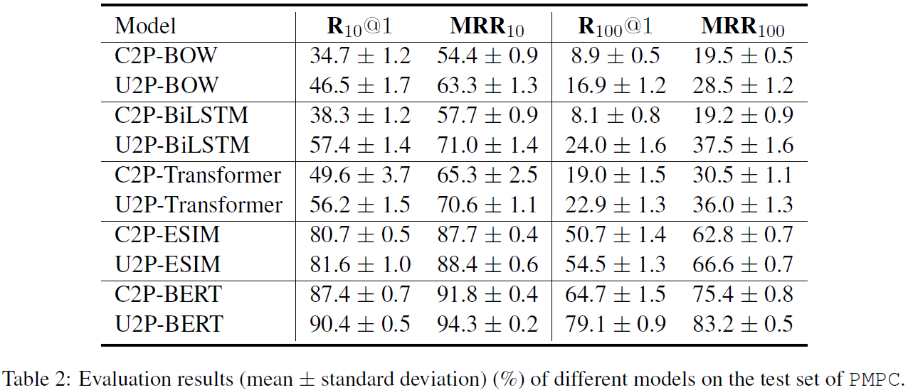

# Detecting Speaker Personas from Conversational Texts
This repository contains the source code and the dataset for the _EMNLP 2021_ paper _Detecting Speaker Personas from Conversational Texts_. Jia-Chen Gu, Zhen-Hua Ling, Yu Wu, Quan Liu, Zhigang Chen, Xiaodan Zhu.  
Hopefully, we will release the code and the datset at the beginning of October.  

## Introduction
Personas are useful for dialogue response prediction. However, the personas used in current studies are pre-defined and hard to obtain before a conversation. To tackle this issue, we study a new task, named Speaker Persona Detection (SPD), which aims to detect speaker personas based on the plain conversational text. In this task, a best-matched persona is searched out from candidates given the conversational text. This is a many-to-many semantic matching task because both contexts and personas in SPD are composed of multiple sentences. The long-term dependency and the dynamic redundancy among these sentences increase the difficulty of this task. We build a dataset for SPD, dubbed as Persona Match on Persona-Chat (PMPC). Furthermore, we evaluate several baseline models and propose utterance-to-profile (U2P) matching networks for this task. The U2P models operate at a fine granularity which treat both contexts and personas as sets of multiple sequences. Then, each sequence pair is scored and an interpretable overall score is obtained for a context-persona pair through aggregation. Evaluation results show that the U2P models outperform their baseline counterparts significantly.

## Update
Please keep an eye on this repository if you are interested in our work.
Feel free to contact us (gujc@mail.ustc.edu.cn) or open issues.
